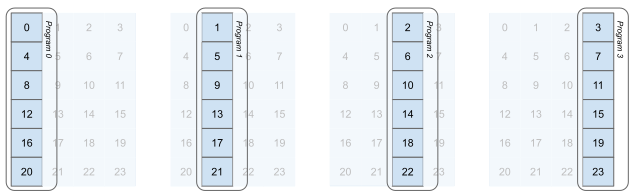
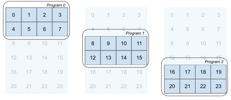

# Block Pointers

Pointer arithmetic can be tedious work and it's easy to mess up.
Not to mention that we have not worked with loading blocks of 2D data, introducing multidimensional pointer blocks.

Let's steer clear of all that, and start using the block pointer functionality that is still an experimental feature. It changes the setup from this:

```python
:::import triton
:::import triton.language as tl
:::import torch
:::
:::def sum_row(A: torch.Tensor) -> torch.Tensor:
:::    """Calculate the sum of a tensor A along the final dim.
:::
:::    Args:
:::        A: Tensor of shape (M, N) containing the input values.
:::
:::    Returns:
:::        Tensor of shape (M, ) containing the summed values.
:::    """
:::    M, N = A.shape
:::    outputs = torch.empty((M,), dtype=A.dtype, device=A.device)
:::
:::    launch_grid = (M, )
:::
:::    sum_kernel[launch_grid](
:::        A, outputs,
:::        BLOCK=N,
:::        A_strides_x=A.strides(0), A_strides_y=A.strides(1),
:::    )
:::
:::    return outputs
:::
@triton.jit
def sum_kernel(A_ptr, outputs_ptr, BLOCK, A_strides_x, A_strides_y):
    program_id = tl.program_id(axis=0)
    offsets = tl.arange(0, BLOCK) + A_ptr + program_id * A_stride_y    
```

To this:

```python
:::import triton
:::import triton.language as tl
:::import torch
:::
:::def sum_row(A: torch.Tensor) -> torch.Tensor:
:::    """Calculate the sum of a tensor A along the final dim.
:::
:::    Args:
:::        A: Tensor of shape (M, N) containing the input values.
:::
:::    Returns:
:::        Tensor of shape (M, ) containing the summed values.
:::    """
:::    M, N = A.shape
:::    outputs = torch.empty((M,), dtype=A.dtype, device=A.device)
:::
:::    launch_grid = (M, )
:::
:::    sum_kernel[launch_grid](
:::        A, outputs,
:::        BLOCK=N,
:::        A_strides_x=A.strides(0), A_strides_y=A.strides(1),
:::    )
:::
:::    return outputs
:::
@triton.jit
def sum_kernel(A_ptr, outputs_ptr, M, N, A_strides_x, A_strides_y):
    program_id = tl.program_id(axis=0)
    offsets = tl.make_block_ptr(
        base=A_ptr,
        shape=(M, N),
        strides=(input_stride_x, A_stride_y),
        offsets=(program_id, 0),
        block_shape=(1, N),
        order=(1, 0),
    )
```
A little bit more work and more added arguments, but this allows us to load 1D and 2D blocks with ease, and we can also skip any masking for out-of-bounds memory access. The table below gives a brief description per argument.

| abc         | def |
|-------------|-----|
| base        | The data pointer from which you want to load a block |
| shape       | Shape of the base tensor |
| strides     | Strides of the base tensor |
| offsets     | From what location do you want to start loading data |
| block_shape | What is the shape of the data block to load |
| order       | The memory layout of the base tensor |

Want to load columns? Want to load blocks? No worries! Below are some examples of block pointers and figures representing the access patterns. You can see the hidden code too if you'd like, but its a spoiler for the rest of the introduction chapter.

### Loading Columns
```python
offsets = tl.make_block_ptr(
    base=A_ptr,
    shape=(M, N),
    strides=(input_stride_x, A_stride_y),
    offsets=(0, program_id),
    block_shape=(M, 1),
    order=(1, 0),
)
```



### Loading Blocks of Rows
```python
offsets = tl.make_block_ptr(
    base=A_ptr,
    shape=(M, N),
    strides=(input_stride_x, A_stride_y),
    offsets=(0, program_id),
    block_shape=(BLOCK_M, N),
    order=(1, 0),
)
```



## Advancing Block Pointers
This section is more for reference since we will not have to advance any block pointers for the row-sum kernel. It *is* an important element of matrix multiplication kernel though. Imagine we are not capable of loading the entire row into memory - it's too big for our cache! What *can* do, is iterate over the row in blocks. the iterative part is where [`tl.advance`]() comes into play.

We now load a vector length `BLOCK_N` and will have to do this untill we reach the end of the row, so we take steps from `0` to `N` in `BLOCK_N` steps:

```python
offsets = tl.make_block_ptr(
    base=A_ptr,
    shape=(M, N),
    strides=(input_stride_x, A_stride_y),
    offsets=(0, program_id),
    block_shape=(1, BLOCK_N),
    order=(1, 0),
)

for _ in range(0, N, BLOCK_N):
    offsets = tl.advance(offsets, (0, BLOCK_N))
```

There are some consequences in terms of out-of-bounds memory access checking, but we will cover this is the next section.