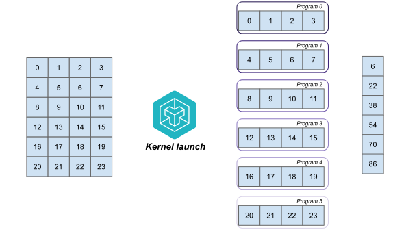

# The Launch Grid
A Triton kernel will launch a number of *programs* to distribute the work over blocks of data. You might want to run more or less programs depending on how much your hardware can handle, and you can control the number of programs to be launched in the *launch grid*. It's a simple tuple (or callable that returns a tuple) that denotes the number of programs to be launched. Say we want to calculate the sum of rows of a matrix ***A*** (`A.sum(axis=1)`), we can make a simple decision to launch exactly the number of rows as programs with the launch grid `(num_rows, )`.

The figure below shows this configuration with a launch grid of `(6, )`. PID is the ***Program Identifier***, a way inside of the Triton kernel to identify the current program at work.



Step (1) shows the matrix ***A***, Step (2) shows how Triton divides the programs and step (3) shows the end-result, a vector of sums per row.


Alternatively, we can divide the work between sets of rows and block of columns. If we keep the number of programs equal to 6, each program can also process two rows and half a column with a launch grid of `(3, 2)`:


The only difference here is step (2), where it now processes 2 rows and 2 columns for each program instead of a whole row. This change does have an effect on performance since we are no longer loading blocks of contiguous memory. 

Multidimensional launch grids are not very common, or at least not from what I've seen. In the exercises we will mainly stick to 1D grids.

## In Code

If we have a Triton kernel `row_sum_kernel` we can define its launch grid before the function call: `row_sum_kernel[(6, )](arg1, arg2, ...)`. We've mentioned before that the launch grid can also be a callable that returns a tuple, and this is the common way of defining the launch grid. The added benefit is that we can dynamically specify the number of programs to launch:

```python,hidelines=~
~import torch
~import triton
~
~
def row_sum(A: torch.Tensor):
    M, N = A.shape
    output = torch.empty_like(M)

    # The launch grid can automatically take values from the arguments!
    grid = lambda args: (triton.cdiv(M, args['BLOCK_SIZE']), )

    # Kind of nonsensical, but here we define a block size of 1 indicating
    # that we divide the number of rows by 1.
    row_sum_kernel[grid](x, y, output, n_elements, BLOCK_SIZE=1)
    return output
```

Of course, we have hard-coded the value of `BLOCK_SIZE=1` above. We will see ways of dynamically changing this in the [Optimization](/optimization/optimization.md) chapter.