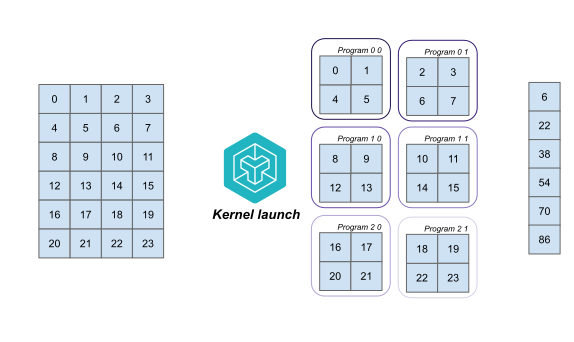

# The Launch Grid
A Triton kernel will launch a number of *programs* to distribute the work over blocks of data.
The number of programs to run is a variable we can change, it depends on both the hardware present and the complexity of the algorithm.
We can control the number of programs and other hyper parameters dependent on hardware/algorithmic complexity in the *launch grid*.

As an example, lets try to calculate the sum of rows of an \\(M \times N\\) matrix \\(A\\), in torch it would equal `A.sum(axis=1)`.
A possible kernel here would be one that launches as many programs as there are rows, and lets each program essentially perform a vector sum. An example of the corresponding launch grid is shown in code below:

```python
:::import torch
:::
:::
def sum_row(inputs: torch.Tensor) -> torch.Tensor:
:::    """Calculate the sum of a tensor along the final dim.
:::
:::    Args:
:::        inputs: Tensor of shape (M, N) containing the input values.
:::
:::    Returns:
:::        Tensor of shape (M, ) containing the summed values.
:::    """
    M, N = inputs.shape
    outputs = torch.empty((M,), dtype=inputs.dtype, device=inputs.device)

    launch_grid = (M, )

    sum_kernel[launch_grid](
        input_ptr=inputs, output_ptr=outputs,
        M=M, N=N,
        input_stride_x=inputs.stride(0), input_stride_y=inputs.stride(1),
    )

    return outputs
```

For now, assume the kernel `sum_kernel` is a valid Triton kernel. A valid triton kernel is called with the funky `kernel[launch_grid]()` arg to denote **which version of the kernel you want to launch**. Think of it as a python dictionary where keys are different launch grid configurations and the values are the compiled kernels related to configuration.

For a higher level overview of what is going on, we can look at the figure below. There, PID denotes the *Program Identifier*, a way for Triton to distinguish between the different programs active. Step (1) shows the matrix \\(A\\), step (2) shows how Triton will divide programs over the rows (idealized here in order), and step (3) shows the desired output, a vector of sums per row!


We can also divide the work into sets of rows *and* columns. If we keep the number of programs equal to 6, each program can also process two rows and half a column with the following launch grid:

```python
:::import torch
:::
:::
:::def sum_row(inputs: torch.Tensor) -> torch.Tensor:
:::    """Calculate the sum of a tensor along the final dim.
:::
:::    Args:
:::        inputs: Tensor of shape (M, N) containing the input values.
:::
:::    Returns:
:::        Tensor of shape (M, ) containing the summed values.
:::    """
:::    M, N = inputs.shape
:::    outputs = torch.empty((M,), dtype=inputs.dtype, device=inputs.device)
:::
    launch_grid = (M // 3, N // 2)
:::
:::    sum_kernel[launch_grid](
:::        input_ptr=inputs, output_ptr=outputs,
:::        M=M, N=N,
:::        input_stride_x=inputs.stride(0), input_stride_y=inputs.stride(1),
:::    )
:::
:::    return outputs
```
And again for a higher overview we can look at the figure below.



The only difference here is step (2), where it now processes a block of 2 by 2 data points for each program instead of a whole row. This change can have an effect on performance since we are no longer loading blocks of contiguous memory. Multidimensional launch grids are, however, not very common, or at least not from what I've seen. In the exercises we will stick to 1D grids.

## A Dynamic Launch Grid
So far we have used a static tuple as launch grid, but note: [It can be either Tuple[int], or Callable(metaparameters) -> Tuple[int]](https://github.com/openai/triton/blob/7d3f045045eb8d1a36e01d5b9ba26644304c02cf/python/tutorials/01-vector-add.py#L66C44-L66C116). What are these *metaparameters*? Well, they are any argument that the `jit`'ed kernel has to offer! This is extremely useful, as it means we can create a single kernel with various launch parameters to run on a variety of different machines.

Let's rewrite the example above and make it more dynamic


<!-- 
## In Code

If we have a Triton kernel `row_sum_kernel` we can define its launch grid before the function call: `row_sum_kernel[(6, )](arg1, arg2, ...)`. We've mentioned before that the launch grid can also be a callable that returns a tuple, and this is the common way of defining the launch grid. The added benefit is that we can dynamically specify the number of programs to launch:

```python
:::import torch
:::import triton
:::
:::
def row_sum(A: torch.Tensor):
    M, N = A.shape
    output = torch.empty_like(M)

    # The launch grid can automatically take values from the arguments!
    grid = lambda args: (triton.cdiv(M, args['BLOCK_SIZE']), )

    # Kind of nonsensical, but here we define a block size of 1 indicating
    # that we divide the number of rows by 1.
    row_sum_kernel[grid](x, y, output, n_elements, BLOCK_SIZE=1)
    return output
```

Of course, we have hard-coded the value of `BLOCK_SIZE=1` above. We will see ways of dynamically changing this in the [Optimization](/optimization/optimization.md) chapter. -->