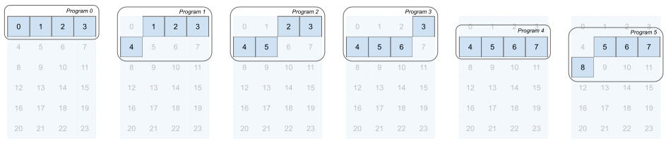
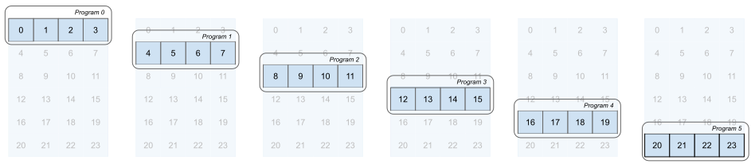

# Program Identifiers
We mentioned this before, but there is a very simple way to identify the current program at work inside Triton: [`triton.language.program_id`](https://triton-lang.org/main/python-api/generated/triton.language.program_id.html#triton.language.program_id). 

With that out of the way, let's start thinking about how we are going to load a single row of matrix \\(A\\). If we take \\(A\\) to be a matrix of size \\(6 \times 4\\) we will run \\(6\\) programs in total:

```python
:::import triton
:::import torch
:::
def sum_row(A: torch.Tensor) -> torch.Tensor:
:::    """Calculate the sum of a tensor A along the final dim.
:::
:::    Args:
:::        A: Tensor of shape (M, N) containing the input values.
:::
:::    Returns:
:::        Tensor of shape (M, ) containing the summed values.
:::    """
    M, N = A.shape
    outputs = torch.empty((M,), dtype=A.dtype, device=A.device)
:::
    launch_grid = (M, )
:::
    sum_row_kernel[launch_grid](A, outputs)
:::
    return outputs

@triton.jit
def sum_row_kernel(A_ptr, outputs_ptr):
    program_id = tl.program_id(axis=0)
```

How do we figure out the correct offset for this `program_id` to load the data? Let's take `program_id = 5` as an example. Program 5 should load the last row in memory. Setting `offset = A_ptr + program_id` will start our data loading at the \\(5\\)th element which is actually the first element of the second row The figure below demonstrates the issue:



In the simple case, we *could* set `offset = A_ptr + N * program_id`.
This will work if our input \\(A\\) has usual strides, but we can't guarantee on that[^1].
In general, we can't guarantee inside the kernel that any of the strides are regular, so even for a step into the \\(x\\) direction we will need to know the strides. For vectors this is a different story, as there torch always has a stride of 1 there.


We can add the strides to the kernel, and with that done, the offset can be calculated as `offset = A_ptr + A_stride_y * program_id`. That only gives us the pointer to the correct row, though. We need pointers to the *entire* row block. So we will actually need to know the length of the row too, another argument we add to the kernel. Getting a block of pointers is straightforward, however, since we can use `triton.language.arange(0, N)`. the [`triton.language.arange`](https://triton-lang.org/main/python-api/generated/triton.language.arange.html#triton.language.arange) function is very similar to its NumPy and Torch counterparts. Now we are loading the right block!



With that done, let's add the additional input arguments to ensure we load the right row from \\(A\\). The updated code can be seen below:

```python
:::import triton
:::import triton.language as tl
:::import torch
:::
def sum_row(A: torch.Tensor) -> torch.Tensor:
:::    """Calculate the sum of a tensor A along the final dim.
:::
:::    Args:
:::        A: Tensor of shape (M, N) containing the input values.
:::
:::    Returns:
:::        Tensor of shape (M, ) containing the summed values.
:::    """
    M, N = A.shape
    outputs = torch.empty((M,), dtype=A.dtype, device=A.device)
:::
    launch_grid = (M, )
:::
    sum_row_kernel[launch_grid](
        A, outputs,
        N=N,
        A_strides_x=A.strides(0), A_strides_y=A.strides(1),
    
    )
:::
    return outputs

@triton.jit
def sum_row_kernel(
    A_ptr, outputs_ptr,
    N,
    A_strides_x, A_strides_y,
):
    program_id = tl.program_id(axis=0)
    offsets = tl.arange(0, N) + A_ptr + program_id * A_stride_y    
```

Pointer arithmetic is not always obvious though, and there is a better albeit experimental way to create block pointers that will now discuss.


[^1]: For a good introduction on strides in Torch see https://zhang-yang.medium.com/explain-pytorch-tensor-stride-and-tensor-storage-with-code-examples-50e637f1076d